ЛР6

Роботу виконали студенти групи ІО-02:
- Воловик Олександр
- Литвиненко Данило
- Шумельчук Юрій

Варіант 16:
><b>Тема:</b> Оренда квартир
 <b>Сутності:</b> Квартира, параметри квартири, опис
 <b>Актори:</b> Хазяїн квартири, клієнт 
 <b>Сценарії використання:</b> 
 Хазяїн квартири: Створення/редагування/видалення інформації про квартиру
 Клієнт: пошук квартири по параметрам

Тестування розробленого API на відповідність опису у документації за допомогою Postman:

GET /api/orders

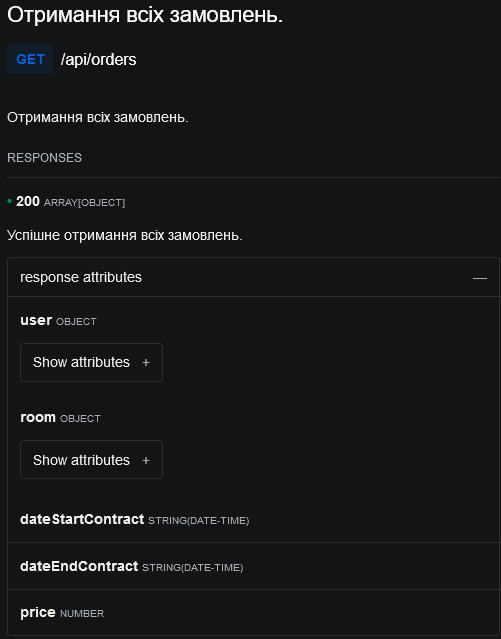
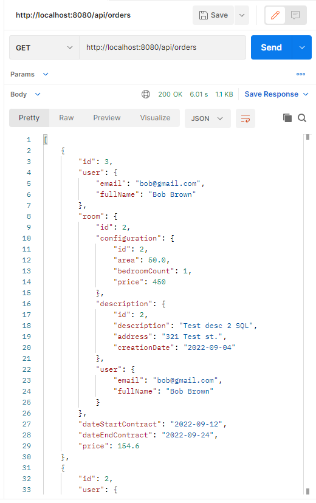

GET /api/rooms (Фільтрація по параметрах та пагінація)

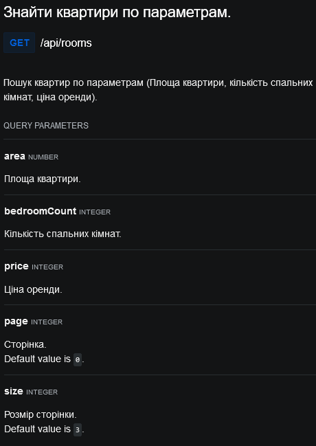
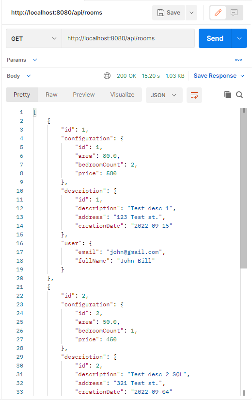
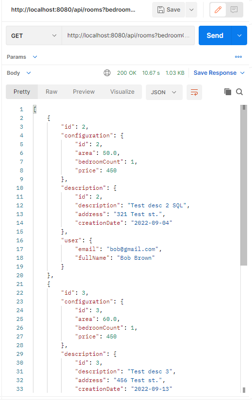
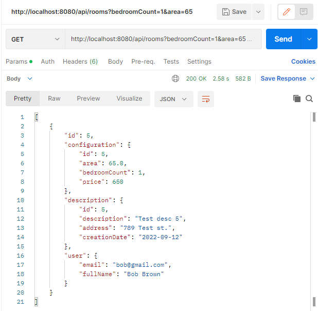

POST /api/rooms

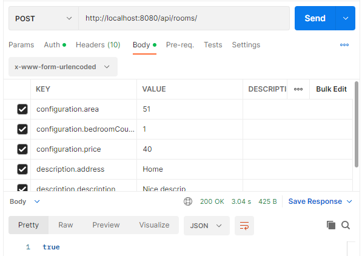
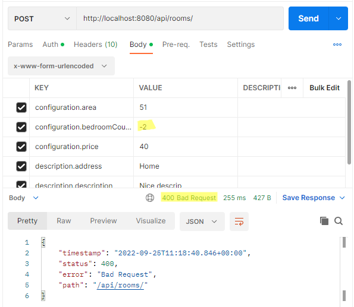
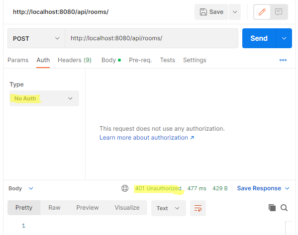

GET /api/rooms/{id}

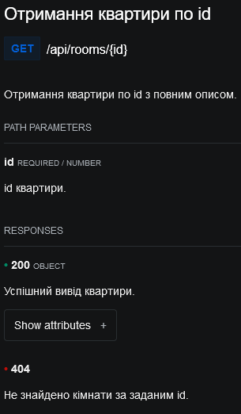
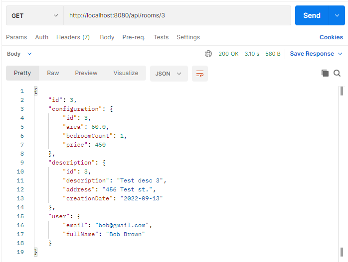
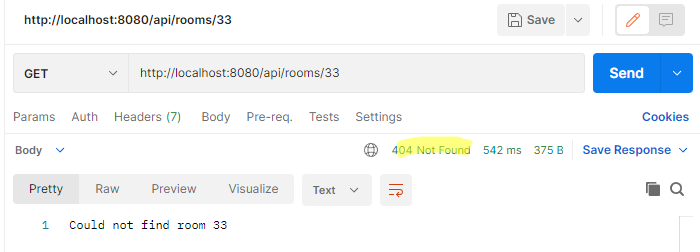

PUT /api/rooms/{id}

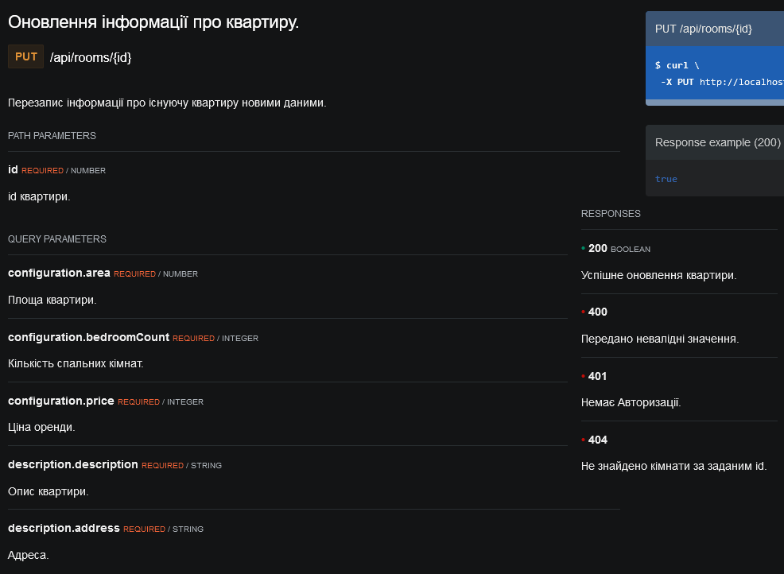
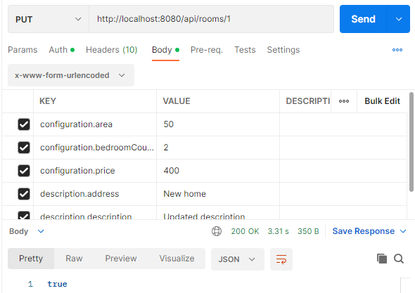
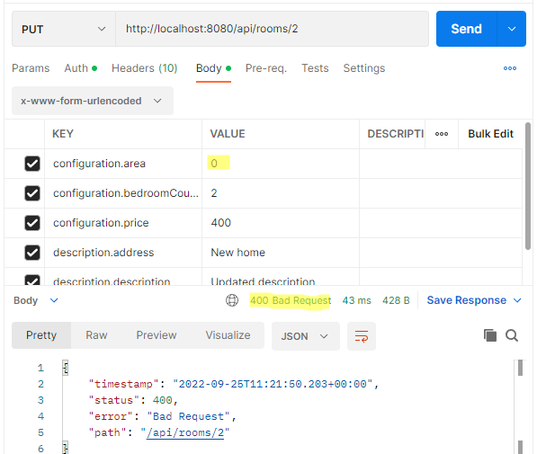
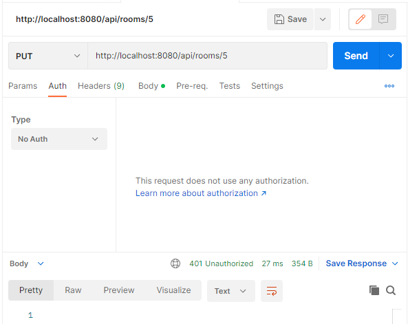
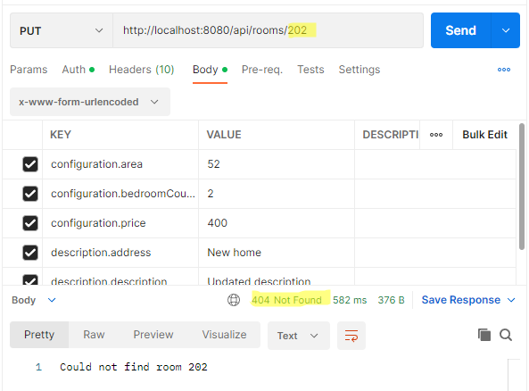

DELETE /api/rooms/{id}

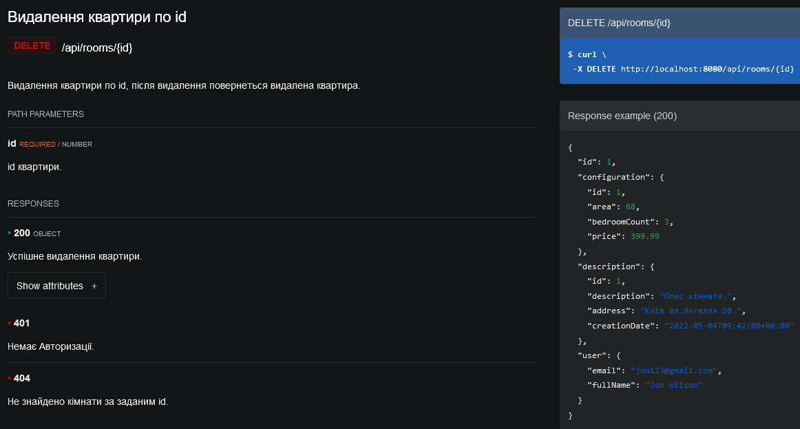
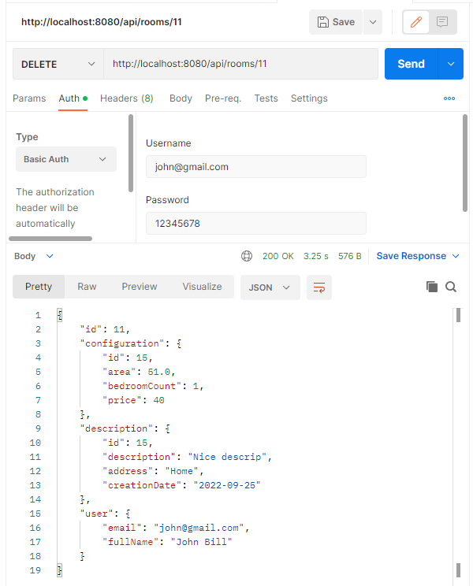
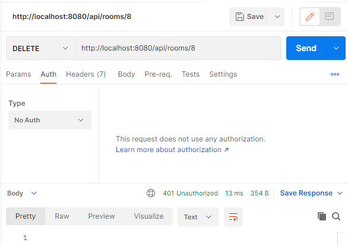
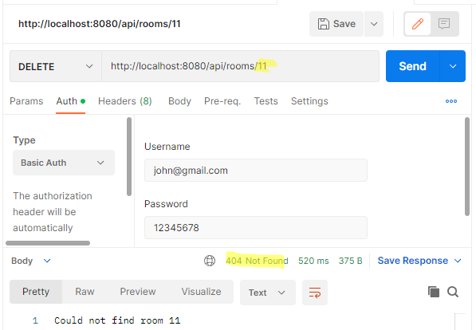

Контрольні питання:

1. Що таке ORM?
 > <b>ORM</b> (Object-Relational Mapping) – технологія програмування, яка пов'язує бази даних із концепціями об'єктно-орієнтованих мов програмування, створюючи «віртуальну об'єктну базу даних». Існують як пропрієтарні, і вільні реалізації цієї технології.   Загалом технологія ORM дозволяє проектувати роботу з даними в термінах класів, а не таблиць даних. Вона дозволяє перетворювати класи на дані, придатні для зберігання базі даних, причому схему перетворення визначає сам розробник. Крім того, ORM надає простий API-інтерфейс для CRUD-операцій над даними. Завдяки технології ORM немає необхідності писати SQL-код для взаємодії з локальною базою даних.
2. В чому полягає різниця між JPA та Hibernate?
 > <b>JPA</b> – специфікація.    <b>Hibernate</b> – реалізація.   JPA також можуть бути свої особливості. JPA це специфікація, а Hibernate – це ORM фреймворк/бібліотека, яка сумісна з JPA. Як і в класичному ООП, клас, який реалізує інтерфейс, може мати додаткові методи/властивості, так і Hiberante має більше можливостей ніж JPA. За деякими даними, сама специфікація JPA була створена на базі ідей, втілених у Hibernate.
3. Поясніть призначення кожного методу з інтерфейсу CrudRepository.
 ><b>Метод save():</b>  Зберігає вказану сутність. Використовуйте повернутий екземпляр для подальших операцій, оскільки операція збереження могла повністю змінити екземпляр сутності.  
> <b>Метод saveAll():</b>  Зберігає всі задані сутності.  
> <b>Метод findById():</b>  Отримує сутність за її ідентифікатором.  
 > <b>Метод existsById():</b>   Повертає, чи існує об’єкт із заданим ідентифікатором.  
 > <b>Метод findAll():</b>  Повертає всі екземпляри типу.  
 > <b>Метод findAllById():</b>  Повертає всі екземпляри типу з указаними ідентифікаторами. Якщо деякі або всі ідентифікатори не знайдено, жодні сутності не повертаються для цих ідентифікаторів. Зауважте, що порядок елементів у результаті не гарантується.  
 > <b>Метод count():</b>  Повертає кількість доступних об’єктів.   
 > <b>Метод deleteById():</b>  Видаляє сутність із заданим ідентифікатором. Якщо сутність не знайдено в сховищі постійності, вона мовчки ігнорується.   
 > <b>Метод delete():</b>  Видаляє вказану сутність.   
 > <b>Метод deleteAllById():</b>  Видаляє всі екземпляри типу з указаними ідентифікаторами. Сутності, яких немає в сховищі постійності, мовчки ігноруються.   
 > <b>Метод deleteAll():</b>  Видаляє всі сутності, якими керує репозиторій.  

4. Яким вимогам має відповідати @Entity-клас?
>1) Entity клас повинен бути позначений анотацією Entity або описаний у файлі XML конфігурації JPA.   
>2) Entity клас повинен містити public або protected конструктор без аргументів (він також може мати конструктори з аргументами).  
>3) Entity клас має бути класом верхнього рівня (top-level class),.  
>4) Entity клас не може бути enum або інтерфейсом.  
>5) Entity клас не може бути фінальним класом (final class).  
>6) Entity клас не може містити фінальні поля або методи, якщо вони беруть участь у мапінгу (persistent final methods or persistent final instance variables).  
>7) Якщо об'єкт Entity класу передаватиметься за значенням як окремий об'єкт (detached object), наприклад через віддалений інтерфейс (through a remote interface), він також повинен реалізовувати Serializable інтерфейс.  
>8) Поля Entity клас повинні бути безпосередньо доступні тільки методам самого Entity класу і не повинні бути безпосередньо доступні іншим класам, які використовують цей Entity. Такі класи повинні звертатися тільки до методів (getter/setter методів або інших методів бізнес-логіки в класі Entity), 9) Entity клас повинен містити первинний ключ, тобто атрибут або групу атрибутів, які унікально визначають запис цього Entity класу в базі даних.
5. Які є типи відношень між сутностями у JPA?
> Зв'язки між таблицями бази даних, як правило, більш ефективні. Тому зв’язки між класами сутностей розглядаються як реляційні таблиці (концепція JPA).  Існують такі типи відношень:  Відношення сутності ManyToOne.   Відношення сутності OneToMany.   Відношення OneToOne.   Відношення сутності ManyToMany.   
> Відношення <b>«ManyToOne»</b> між сутностями: де сутність пов’язана одна з одною (стовпцем або групою стовпців), яка містить унікальні значення. Стовпець або набір стовпців. Ці зв'язки застосовуються до реляційних баз даних із використанням зовнішнього ключа між таблицями.  
> Відношення <b>«OneToMany».</b> У цьому відношенні багато дітей в іншій сутності пов’язані з кожним рядком сутності. Важливо те, що декілька батьків не можуть записувати записи дітей. Кожен рядок у таблиці A пов’язаний з 0,1 або більше рядками таблиці B у зв’язку «один до багатьох» між таблицями A та B.  
> Відношення <b>«OneToOne».</b> Один елемент може належати лише одному іншому елементу у відношенні сутності «один до одного». Це означає, що кожен рядок сутності стосується лише одного рядка іншої сутності.  
> Відношення <b>«ManyToMany»</b> — це один або кілька рядків однієї сутності, які з’єднані з кількома рядками в іншій сутності.
6. Для чого потрібні DTO? Чому замість них не завжди можна використовувати @Entity об’єкти?
> <b>Data Transfer Object (DTO)</b> — один із шаблонів проєктування, який використовують для передачі даних між підсистемами програми.  
> Метою DTO є зібрати в одній відповіді стільки інформації, скільки клієнти вважають необхідними для збереження викликів на сервері. Що робить спілкування клієнт-сервер більш плавним.